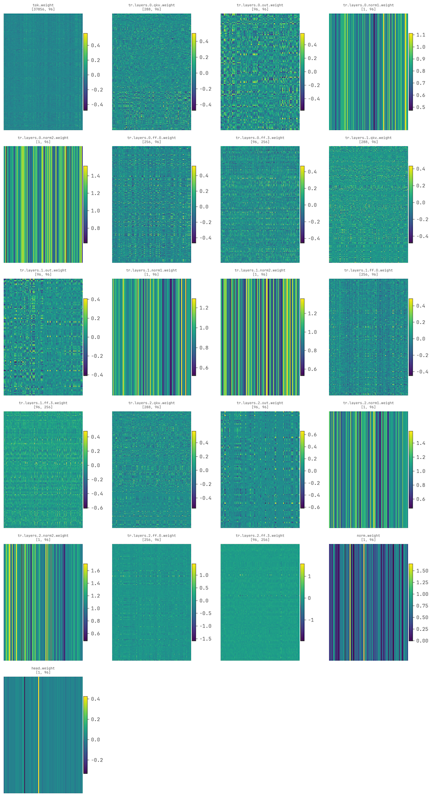

# ml-core
python, pytorch, cuda and mps optimized general machine learning tools, utilities, and notebooks

haven't you ever needed to build an entire end-to-end ml preproccessing, training, evaluation, deployment and inference suite for use with custom models, domains, and architectures?

**utils** \
dataset generation `notebook/text.dataset.ipynb` \ 
dataset filtering \

tokenization (bpe) `notebook/text.tokenization.ipynb` \
scoring trainer notebook `notebook/text.scoring.ipynb` \
moderation trainer notebook `notebook/text.moderation.ipynb` \
rnn trainer notebook \

**models** \
embedding ( text , image ) -> nDim[64-768] \
score ( text : string, text : message[] ) -> real 0 - 1 \
moderation ( text : string, text : message[] ) -> real 0 - 1 \
autoregressive rnn ( text :string, hidden state : hidden[L]) -> text, hidden

okay, so. you start with some generic models. that's okay, they will serve as the basis for our domain models.

so select and build the datasets for your first domain trainings, i went multilingual support, and researched focused domains, you might choose sql, or like emojis if you want. ensure your data is formatted for either pretraining, sft, or post training.

now you can use the generic scoring models, to select the scoring threshold you want to train your domain specific models like scoring and moderation on their specific task. (although in the case of moderation, keeping low quality scoring samples may actually suit the use case.)
this scoring model will exceed the performance when used in your rlvr pipeline than any llm-as-a-judge would be, and far certainly faster. (notebook coming soon)

deploy your models through a python fastapi (coming soon)

**process** \
preprocess (i kinda already did this part for you, and as always, improvements encouraged):
- plan
  - dataset sources
  - labeled score, moderation, image and text samples
  - domain targets
  - model targets
  - vocab size
  - context length
  - train / validation / test / holdout split
  - baseline metrics
- collect
  - pretraining text
  - sft prompt / completion pairs
  - scoring samples
  - moderation samples
  - image / text pairs where useful
  - negative, borderline, and domain specific samples
- normalize
  - fix broken encodings
  - normalize unicode, whitespace, message formats, labels, and score ranges
  - deduplicate exact and near matches
- filter
  - remove empty, corrupt, unusable, and out of context samples
  - remove extreme outliers
  - keep some low quality samples where useful for moderation
- tokenize
  - train generic bpe vocab
  - encode datasets
  - validate decode / encode roundtrip
  - save tokenized shards
- train (general, non domain tuned)
  - embedding
  - score
  - moderation
  - rnn pretraining
- evaluate (general)
  - loss
  - accuracy
  - precision / recall
  - roc / auc
  - confusion matrix
  - threshold curves
  - calibration
  - latency / memory / throughput
- select
  - best checkpoint
  - scoring threshold
  - moderation threshold
  - vocab
  - context length
  - batch size
  - inference precision

generate domain datasets -> generate domain vocabs

- generate domain datasets
  - select domain corpus
  - score samples with generic score model
  - filter by selected score threshold
  - optionally keep low scoring samples for moderation
  - label or relabel domain specific score and moderation samples
  - generate sft prompt / completion pairs
  - generate preference or reward samples where needed
  - deduplicate and split
- generate domain vocabs
  - train domain bpe vocab
  - compare against generic vocab
  - check compression ratio and domain term coverage
  - encode domain datasets
  - save vocab, tokenizer config, and tokenized shards
 

evaluation \
generate domain datasets -> generate domain vocabs

- evaluate domain datasets
  - sample quality distribution
  - label balance
  - token length distribution
  - duplicate rate
  - language / source distribution
  - moderation / score class distribution
- evaluate domain vocabs
  - compression ratio
  - average and max tokens per sample
  - decode correctness
  - domain and multilingual coverage
- evaluate generic models on domain data
  - score model baseline
  - moderation model baseline
  - embedding baseline
  - rnn baseline
- evaluate domain checkpoints
  - compare against generic checkpoint
  - compare against previous domain checkpoint
  - select best checkpoint
  - save metrics, plots, and failure samples

core loop 
- train (domain tuned)
  - score (highest quality samples)
  - moderation (domain labels + useful low quality samples)
  - embedding (domain text / image pairs where available)
  - embedding distillation
  - rnn pretraining continuation
  - rnn sft
- validate
  - validation loss
  - score and moderation thresholds
  - generation quality
  - refusal / safety behavior
  - domain accuracy
  - hallucination rate
  - latency / memory
- inspect
  - best and worst samples
  - false positives / false negatives
  - low confidence samples
  - overfit samples
- update
  - dataset filters
  - thresholds
  - vocab
  - hyperparameters
  - checkpoint selection
- repeat
  - generate cleaner domain dataset
  - retrain domain score, moderation, embedding and rnn sft
  - compare metrics
  - keep only improvements

distillation:
- train (embedding)
  - generate teacher embeddings from larger or stronger embedding model
  - align text and image pairs into shared embedding space
  - train smaller embedding model against teacher vectors
  - preserve domain similarity structure
  - validate retrieval quality against holdout pairs
  - compare embedding drift, recall, precision, and latency
  - keep checkpoint only if it improves retrieval or cost

post:
- train (RLVR / GSPO)
  - generate rollouts from rnn
  - score rollouts with domain score model
  - moderate rollouts with domain moderation model
  - reject unsafe completions
  - assign rewards from score model
  - optionally apply penalties from moderation model
  - train rnn with GSPO using rewards from the score model for the target domain
  - validate against holdout prompts
  - compare against sft checkpoint
  - keep checkpoint only if it improves target metrics
- evaluate (post training)
  - reward distribution
  - score improvement
  - moderation regression
  - response length drift
  - repetition drift
  - domain correctness
  - latency / memory
  - failure cases
- package
  - model weights
  - tokenizer
  - vocab
  - config
  - metrics
  - plots
  - sample outputs
  - version metadata

web api with response caching

- serve
  - fastapi model server
  - tokenizer and checkpoint loading
  - cuda / mps / cpu device selection
  - batched inference
  - streaming generation where useful
  - score endpoint
  - moderation endpoint
  - embedding endpoint
  - rnn generation endpoint
- cache
  - cache tokenization
  - cache embeddings
  - cache score and moderation results
  - cache generated responses where safe
  - invalidate by model and tokenizer version
- observe
  - request latency
  - token throughput
  - gpu / mps memory
  - cache hit rate
  - error rate
  - score and moderation distributions
- ship
  - versioned models
  - versioned configs
  - versioned tokenizers
  - reproducible evals
  - rollback path

__scoring model matrices__ (there are many cool visualizations throughout)
